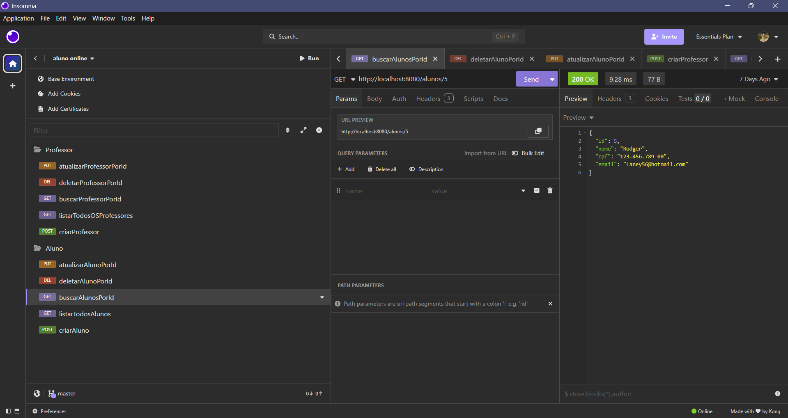
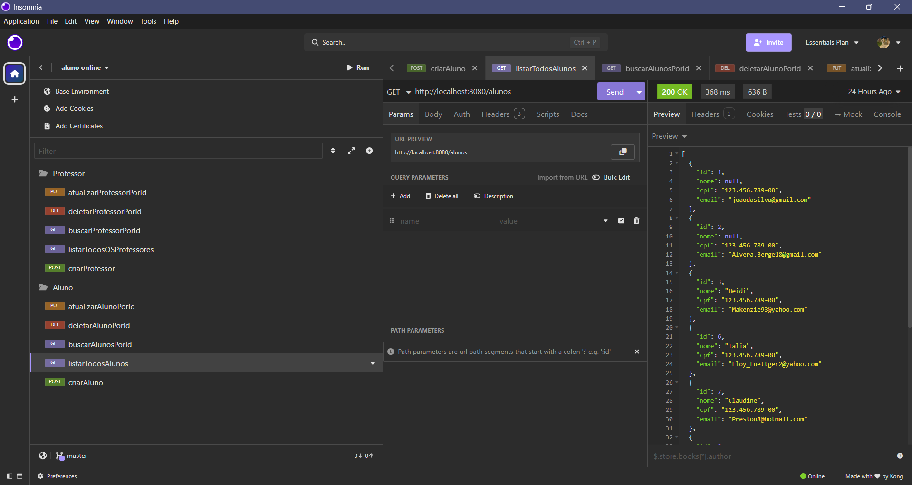
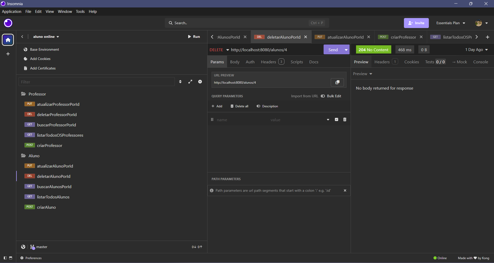
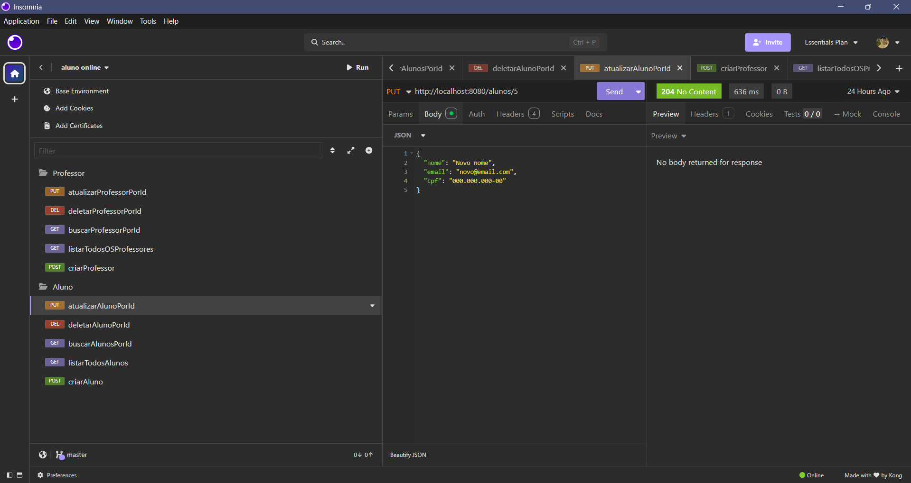
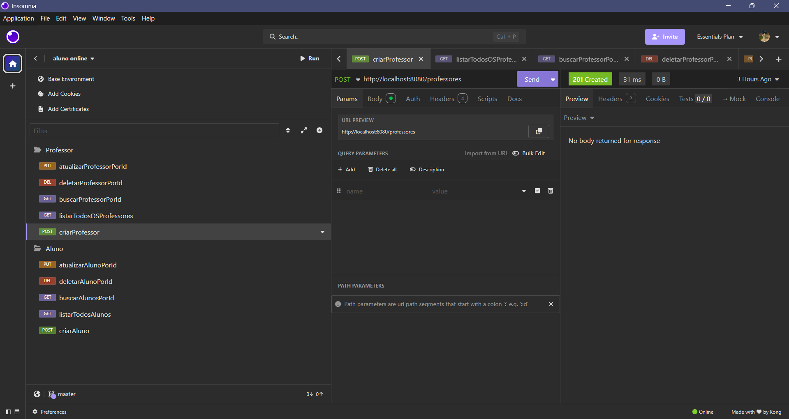
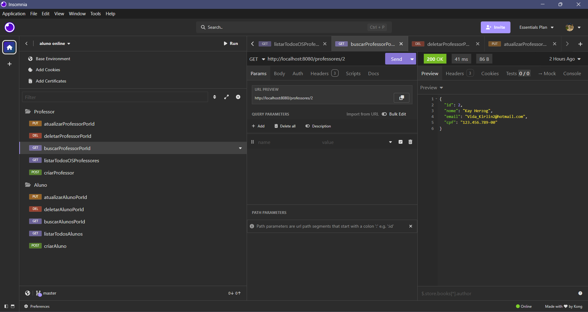
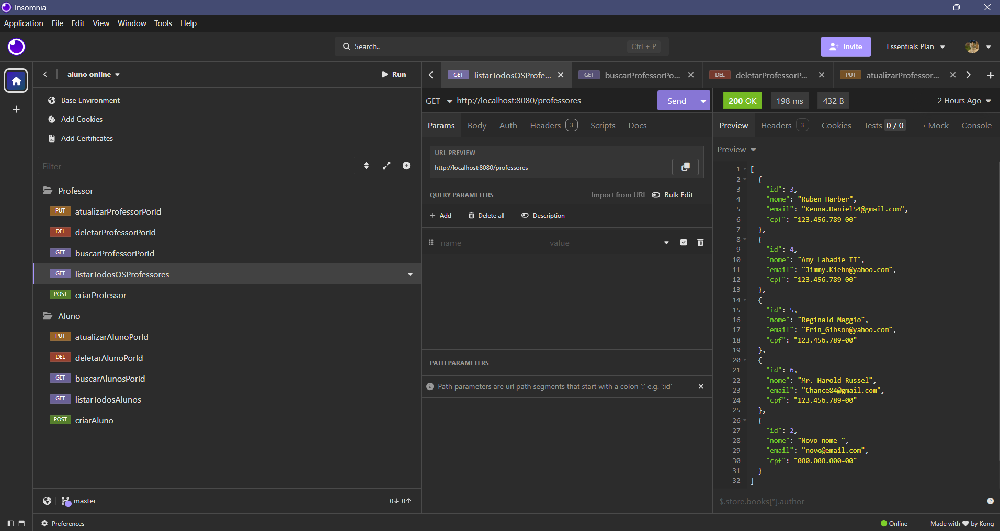
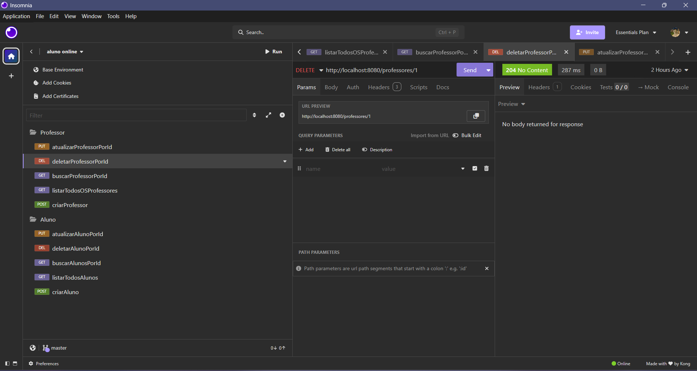
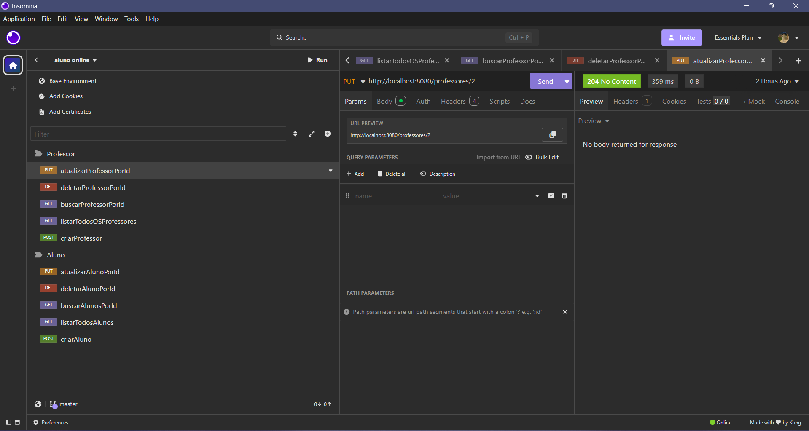

# 📚 Aluno Online API

## 📌 Descrição do Projeto

Este projeto consiste em uma API REST desenvolvida em Java utilizando o framework Spring Boot.
A aplicação tem como objetivo gerenciar alunos e professores, permitindo operações completas de CRUD (Create, Read, Update e Delete).

Este projeto foi desenvolvido como atividade acadêmica da disciplina de Java Spring.

---

## ⚙️ Tecnologias Utilizadas

* Java
* Spring Boot
* Spring Web
* Spring Data JPA
* Maven
* Banco de dados (MySQL ou H2)
* Insomnia (testes de API)
* DBeaver (visualização do banco de dados)

---

## 🏗️ Arquitetura do Projeto

O projeto segue o padrão de arquitetura em camadas (Layered Architecture):

### 🔹 Controller

Responsável por receber as requisições HTTP e retornar as respostas.

### 🔹 Service

Responsável pelas regras de negócio da aplicação.

### 🔹 Repository

Responsável pela comunicação com o banco de dados.

### 🔹 Model

Representa as entidades do sistema.

---

## 📂 Estrutura do Projeto

```
src/
 ├── controller
 ├── service
 ├── repository
 └── model
```

---

## 👨‍🎓 CRUD de Aluno

* ➕ Criar aluno → POST /alunos
* 📋 Listar alunos → GET /alunos
* 🔍 Buscar por ID → GET /alunos/{id}
* ✏️ Atualizar → PUT /alunos/{id}
* ❌ Deletar → DELETE /alunos/{id}

---

## 👨‍🏫 CRUD de Professor

* ➕ Criar professor → POST /professores
* 📋 Listar professores → GET /professores
* 🔍 Buscar por ID → GET /professores/{id}
* ✏️ Atualizar → PUT /professores/{id}
* ❌ Deletar → DELETE /professores/{id}

---

## 🧪 Testes no Insomnia













---

## 🗄️ Banco de Dados


---

## 🚀 Como Executar o Projeto

1. Clone o repositório:

```
git clone https://github.com/seu-usuario/aluno_online_api_java_spring.git
```

2. Abra no IntelliJ

3. Execute a classe principal:

```
AlunoOnlineApplication
```

4. Acesse:

```
http://localhost:8080
```

---

## 📌 Autor

Matheus Padilha Ramos Neves.
Projeto desenvolvido para fins acadêmicos.
