# 📚 Aluno Online API

## 📌 Descrição do Projeto

Este projeto consiste em uma API REST desenvolvida em Java utilizando o framework Spring Boot.
A aplicação tem como objetivo gerenciar alunos, professores, disciplinas e matrículas, permitindo operações completas de CRUD (Create, Read, Update e Delete), além de funcionalidades acadêmicas como trancamento de matrícula, atualização de notas e emissão de histórico escolar.

A API foi testada utilizando o Insomnia e os dados persistidos foram validados através do DBeaver.

O projeto utiliza arquitetura em camadas, DTOs para transferência de dados, relacionamento entre entidades com JPA/Hibernate e integração com banco de dados PostgreSQL, incluindo utilização de Views e Triggers para automatização e organização de consultas no banco.

Este projeto foi desenvolvido como atividade acadêmica da disciplina de Java Spring.

---

## ⚙️ Tecnologias Utilizadas

* Java
* Spring Boot
* Spring Web
* Spring Data JPA
* Hibernate
* Maven
* PostgreSQL
* DTO (Data Transfer Object)
* JPA Relationships (ManyToOne)
* SQL Triggers
* SQL Views
* Insomnia (testes de API)
* DBeaver (visualização do banco de dados)
  
---

## 🏗️ Arquitetura do Projeto

O projeto segue o padrão de arquitetura em camadas (Layered Architecture), promovendo organização, reutilização de código e separação de responsabilidades.

🔹 Controller

Responsável por receber as requisições HTTP, processar endpoints REST e retornar as respostas da API.

🔹 Service

Responsável pelas regras de negócio da aplicação e tratamento das operações.

🔹 Repository

Responsável pela comunicação com o banco de dados através do Spring Data JPA.

🔹 Model

Representa as entidades do sistema e seus relacionamentos.

 🔹 DTO

Responsável pela transferência de dados entre as camadas da aplicação, evitando exposição direta das entidades.

🔹 Database

Banco de dados PostgreSQL contendo:

* tabelas relacionais
* Views SQL
* Triggers SQL
* constraints e relacionamentos

```

📂 Estrutura do Projeto
src/
 ├── controller
 ├── dto
 ├── service
 ├── repository
 ├── model
 ├── config
 └── resources
      ├── application.properties
      └── database

---

🔗 Relacionamentos JPA

O projeto utiliza relacionamentos entre entidades através do JPA/Hibernate.

✔ ManyToOne

Exemplo:

Uma matrícula pertence a um aluno
Uma matrícula pertence a uma disciplina
Uma disciplina pode possuir um professor

Esses relacionamentos foram implementados utilizando:

@ManyToOne
@JoinColumn(name = "id_aluno")
private Aluno aluno;

---

## 🗄️ Banco de Dados PostgreSQL

O projeto utiliza o PostgreSQL como banco de dados principal.

Além das tabelas relacionais, foram implementados:

🔹 Views

Utilizadas para facilitar consultas acadêmicas e relatórios.

🔹 Triggers

Responsáveis por automatizar comportamentos no banco de dados, garantindo maior integridade e automação.

---

## 👨‍🎓 CRUD de Aluno

* ➕ Criar aluno → POST /alunos
* 📋 Listar alunos → GET /alunos
* 🔍 Buscar por ID → GET /alunos/{id}
* ✏️ Atualizar → PUT /alunos/{id}
* ❌ Deletar → DELETE /alunos/{id}

---

## 👨‍🏫 CRUD de Professor

* ➕ Criar professor → POST /professores
* 📋 Listar professores → GET /professores
* 🔍 Buscar por ID → GET /professores/{id}
* ✏️ Atualizar → PUT /professores/{id}
* ❌ Deletar → DELETE /professores/{id}

---

## 📚 CRUD de Disciplina
  
* ➕ Criar disciplina → POST /disciplinas
* 📋 Listar disciplinas → GET /disciplinas
* 🔍 Buscar disciplina por ID → GET /disciplinas/{id}
* ✏️ Atualizar disciplina → PUT /disciplinas/{id}
* ❌ Deletar disciplina → DELETE /disciplinas/{id}

---

## 📝 Funcionalidades de Matrícula

* ➕ Criar matrícula
* 🔒 Trancar matrícula
* 🔓 Destrancar matrícula
* 📝 Atualizar notas
* 📄 Emitir histórico escolar

---

## 🧪 Testes no Insomnia

### Criar Aluno
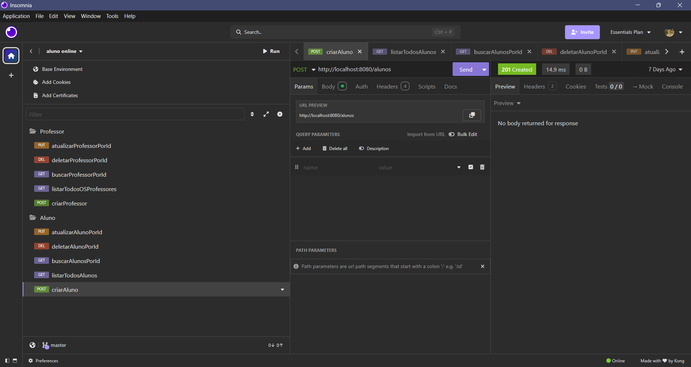

### Buscar Alunos Por Id


### Listar Todos Os Alunos


### Deletar Aluno Por Id


### Atualizar Aluno Por Id


### Criar Professor


### Buscar Professor Por Id


### Listar Todos Os Professores


### Deletar Professor Por Id


### Atualizar Professor Por Id


### Criar Disciplina
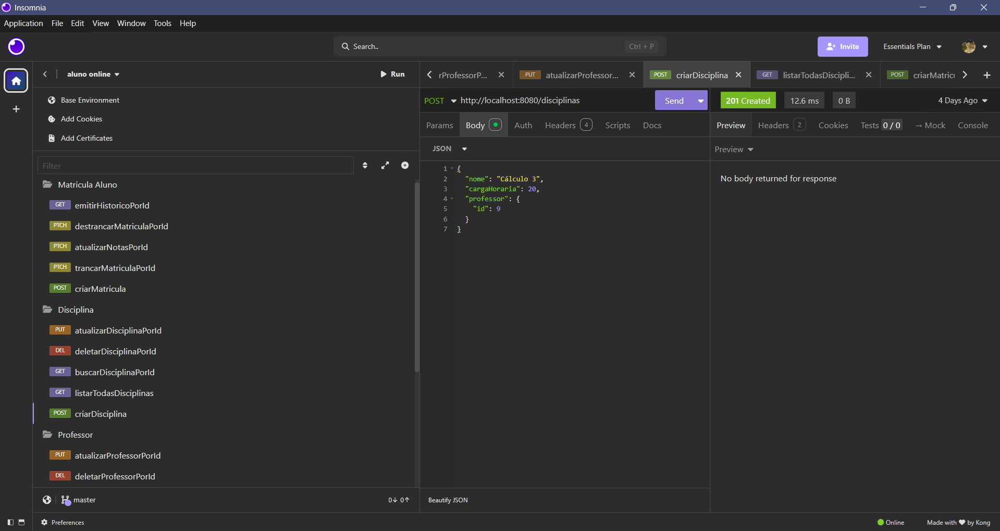

### Listar Todas Disciplinas
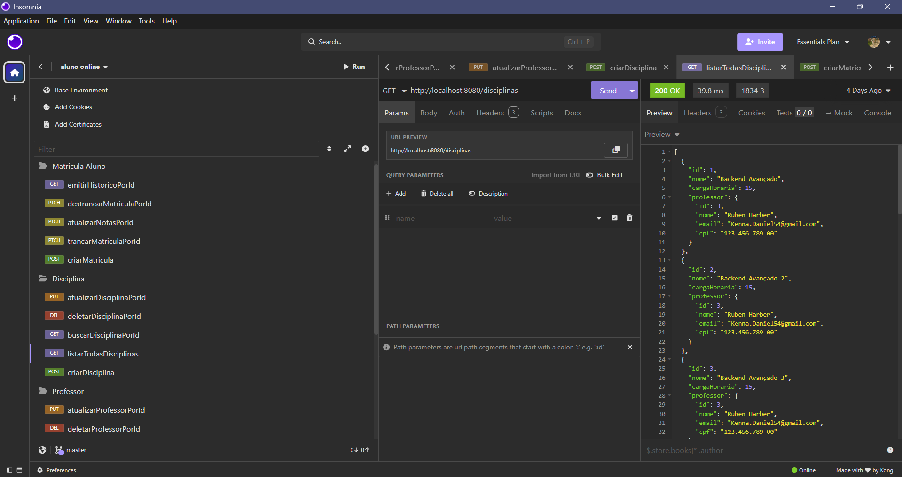

### Buscar Disciplina Por Id


### Deletar Disciplina Por Id
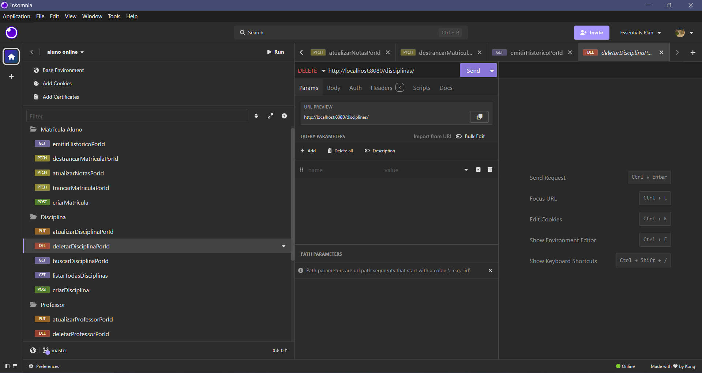

### Atualizar Disciplina Por Id
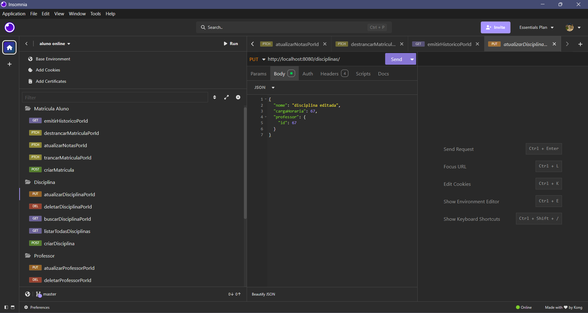

### Criar Matricula
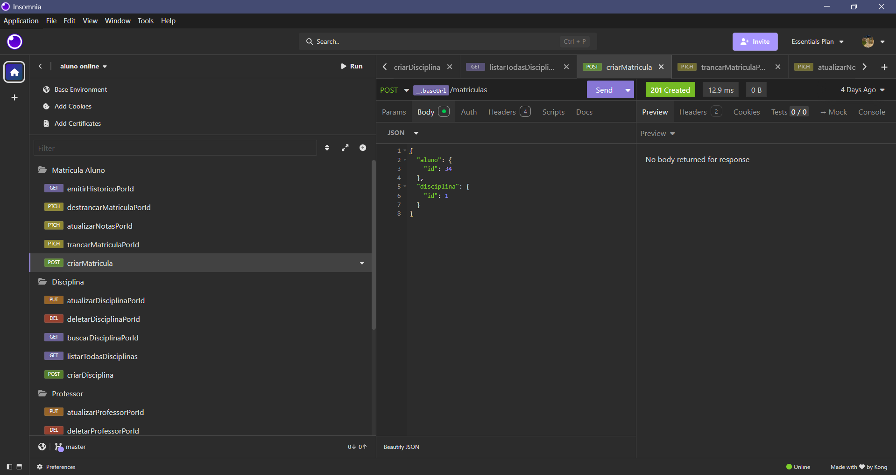

### Trancar Matricula Por Id
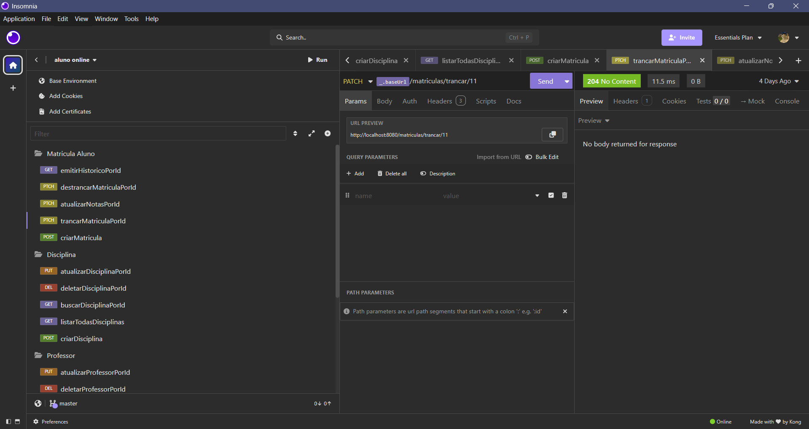

### Atualizar Notas Por Id
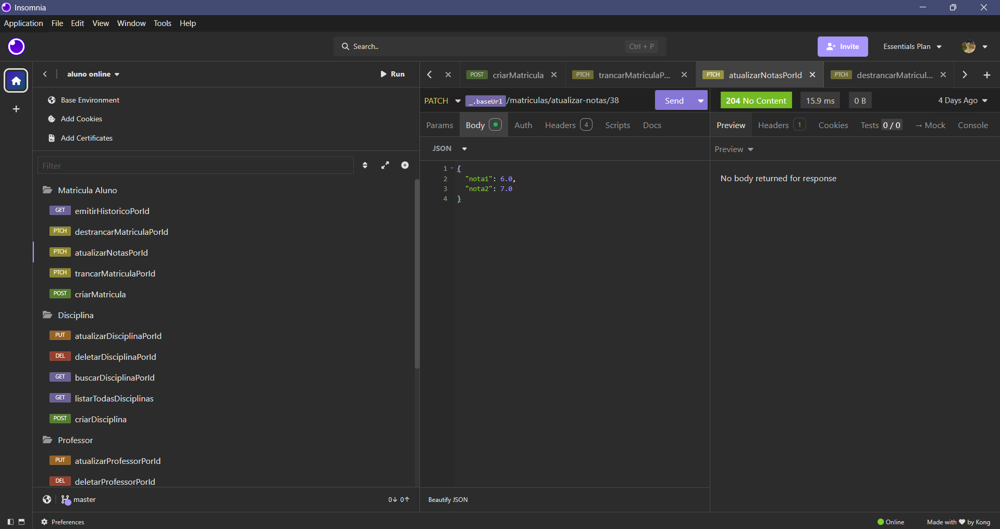

### Destrancar Matricula Por Id
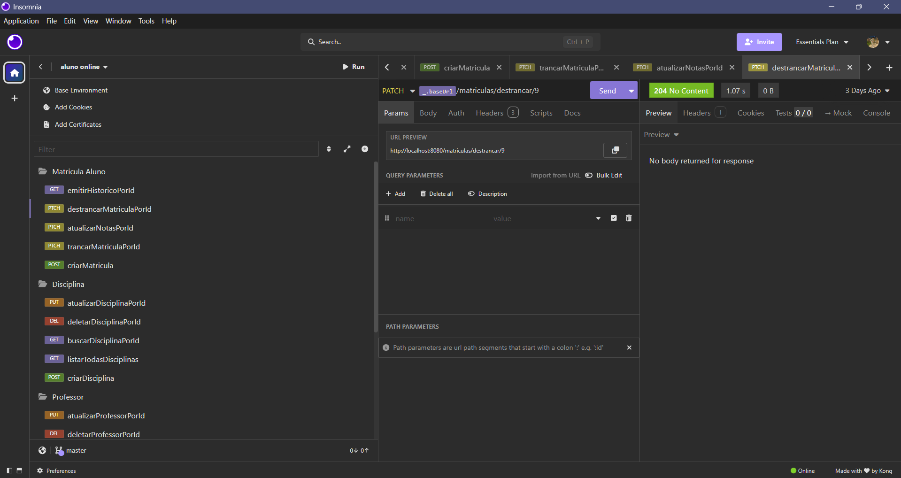

### Emitir Historico Por Id
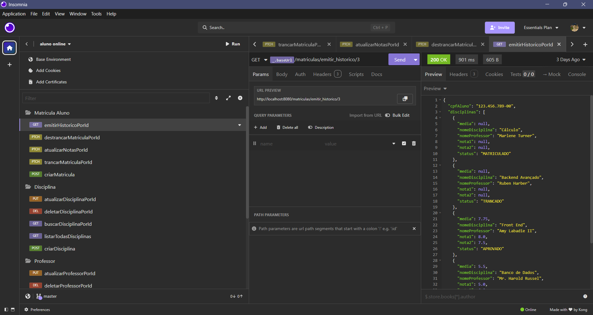

---

## 🗄️ Banco de Dados

### Tabela Aluno
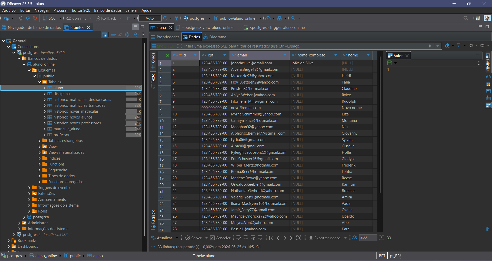

### Tabela Professor
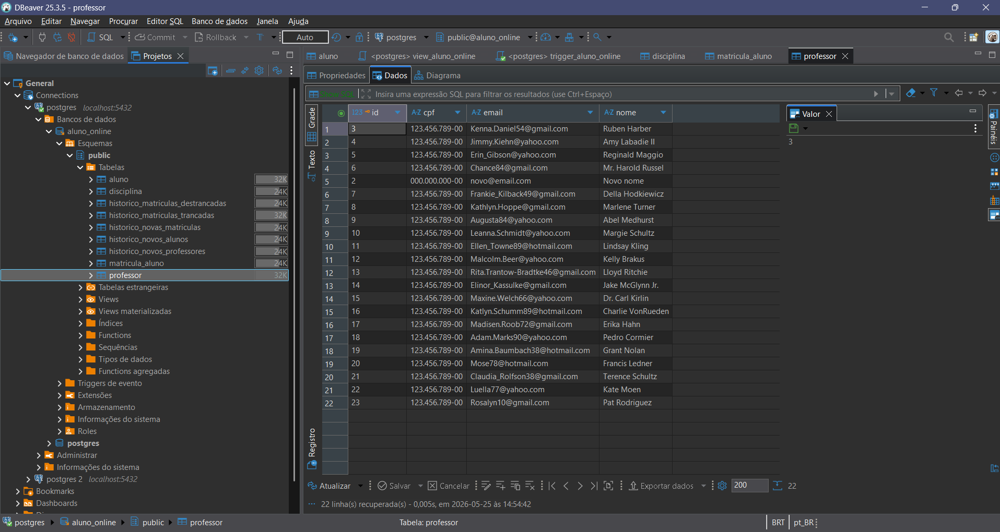

### Tabela Disciplina
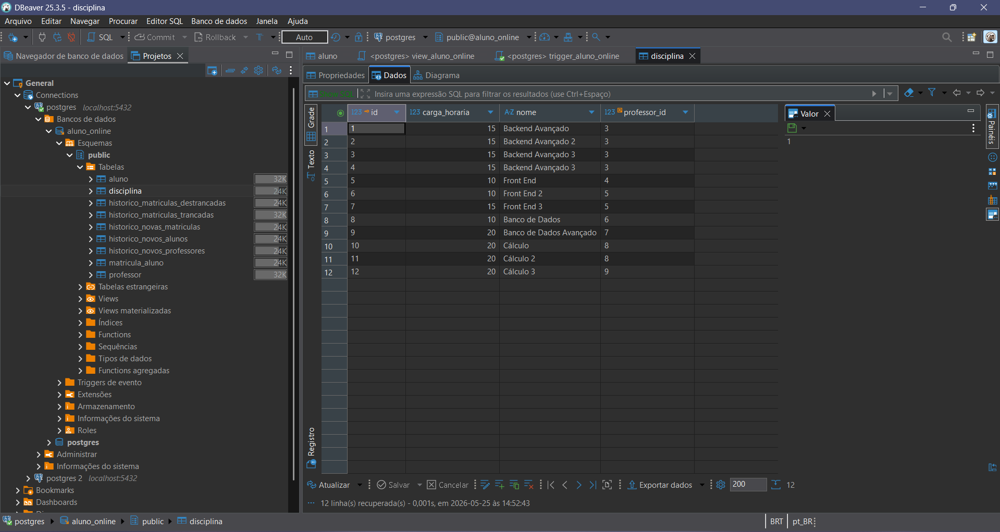

### Tabela Matricula Aluno
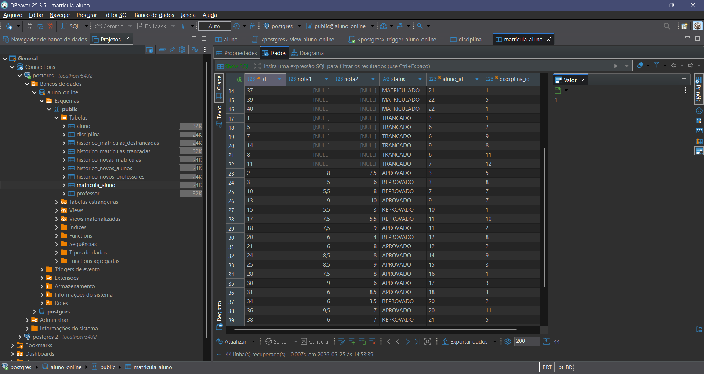

---

## 🚀 Como Executar o Projeto

1️⃣ Clone o repositório
git clone https://github.com/NevesEz/aluno_online_api_java_spring.git


2️⃣ Abra no IntelliJ IDEA

Importe o projeto Maven normalmente.


3️⃣ Configure o PostgreSQL

Edite o arquivo:

application.properties

Configure:

spring.datasource.url=
spring.datasource.username=
spring.datasource.password=


4️⃣ Execute a aplicação

Execute a classe principal:

AlunoOnlineApplication


5️⃣ Acesse a API
http://localhost:8080

---

## 📖 Conceitos Aplicados

* API REST
* CRUD
* Spring Boot
* DTO Pattern
* JPA/Hibernate
* Relacionamentos ManyToOne
* PostgreSQL
* SQL Triggers
* SQL Views
* Arquitetura em Camadas
* Persistência de Dados
* Boas práticas REST

---

## 📌 Autor

Matheus Padilha Ramos Neves.
Projeto desenvolvido para fins acadêmicos.
